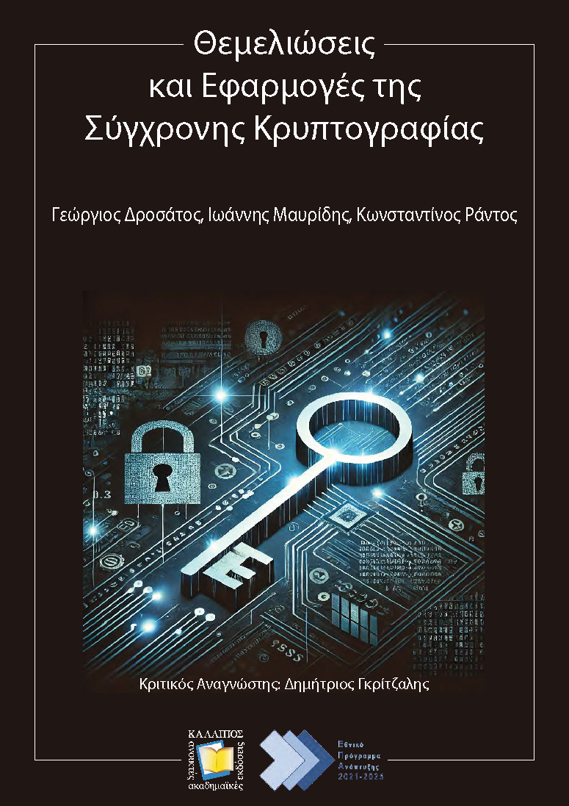

# Exercises
This repo contains all the **exercises** for the following book:
* **In English:**
  - [George Drosatos](https://www.drosatos.info), [Ioannis Mavridis](https://www.uom.gr/en/mavridis) and [Konstantinos Rantos](https://www.linkedin.com/in/rantos/). Foundations and Applications of Modern Cryptography. Critical Reader: Dimitris Gritzalis, [Kallipos - Open Academic Editions](https://repository.kallipos.gr/), Greek Edition, chapters 15, pages 435, 2025. ISBN: 978-618-228-316-5, DOI: [10.57713/kallipos-1067](http://dx.doi.org/10.57713/kallipos-1067).
* **In Greek:**
  - [Γεώργιος Δροσάτος](https://www.drosatos.info), [Ιωάννης Μαυρίδης](https://www.uom.gr/mavridis) και [Κωνσταντίνος Ράντος](https://www.linkedin.com/in/rantos/). Θεμελιώσεις και Εφαρμογές της Σύγχρονης Κρυπτογραφίας. Κριτικός Αναγνώστης: Δημήτριος Γκρίτζαλης, [Κάλλιπος - Ανοικτές Ακαδημαϊκές Εκδόσεις](https://repository.kallipos.gr/), κεφάλαια 15, σελίδες 438, 2025. ISBN: 978-618-228-316-5, DOI: [10.57713/kallipos-1067](http://dx.doi.org/10.57713/kallipos-1067).

